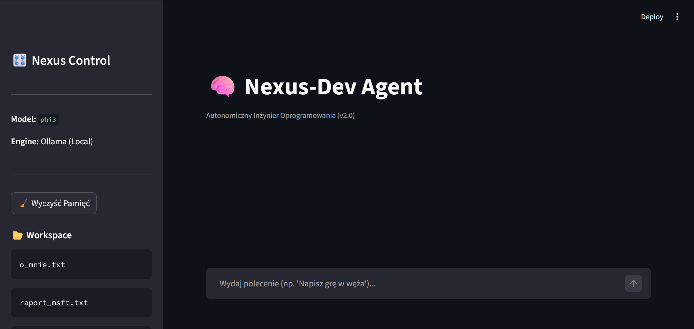

# Nexus-Agent 🧠

**Autonomiczny Agent AI działający lokalnie.**

Nexus-Agent to zaawansowany system, który zamienia Twój komputer w autonomicznego inżyniera oprogramowania. Wykorzystuje lokalne modele LLM (Llama3, Phi3) poprzez Ollama, aby pisać kod, zarządzać plikami, przeszukiwać internet i wykonywać komendy terminala.

## 🚀 Możliwości

*   **100% Prywatności:** Działa lokalnie, żadne dane nie opuszczają Twojego PC.
*   **Autonomia:** Potrafi planować zadania, pisać skrypty w Pythonie i samemu je uruchamiać.
*   **Persistent Memory:** Pamięta kontekst między sesjami.
*   **Bezpieczeństwo:** System "Human-in-the-loop" przed wykonaniem niebezpiecznych komend.

## 🛠️ Instalacja

1. Zainstaluj [Ollama](https://ollama.com).
2. Pobierz model: `ollama run phi3`.
3. Sklonuj repozytorium:
   ```bash
   git clone https://github.com/Radian20Hz/Nexus-Agent.git
   cd Nexus-Agent
4. Zainstaluj zależności:
    pip install -r requirements.txt

## 💻 Użycie

python src/main.py

## ⚠️ Ostrzeżenie

**Agent ma dostęp do terminala Twojego systemu. Używaj rozważnie.**

## 📸 Screenshot


Created by Radian20Hz